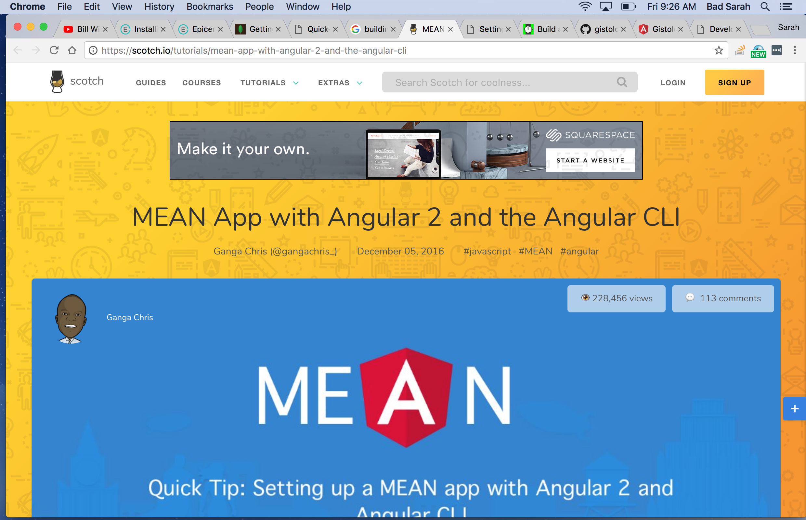
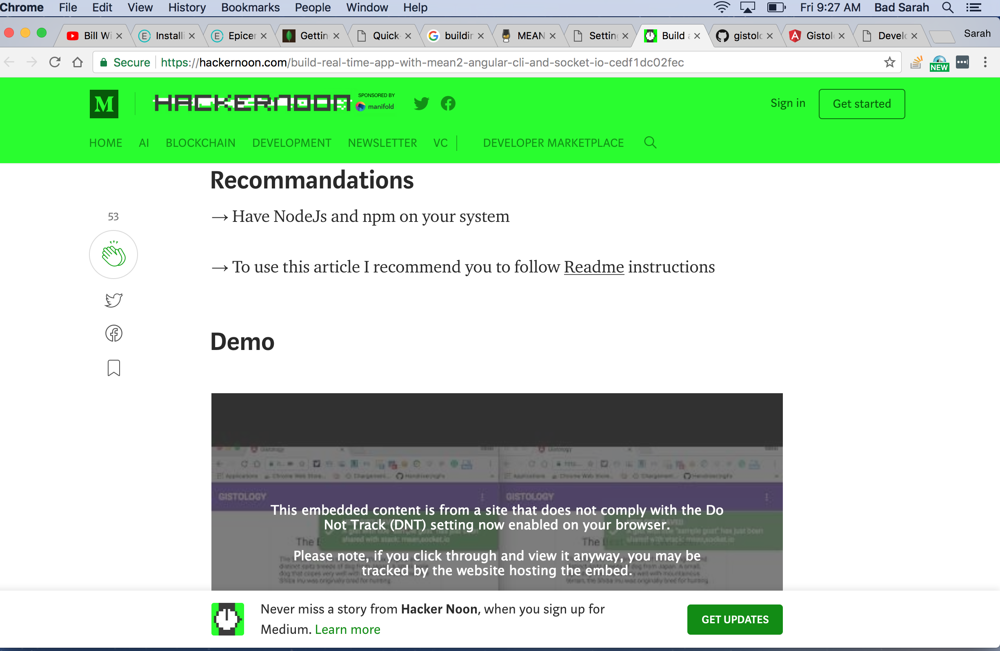
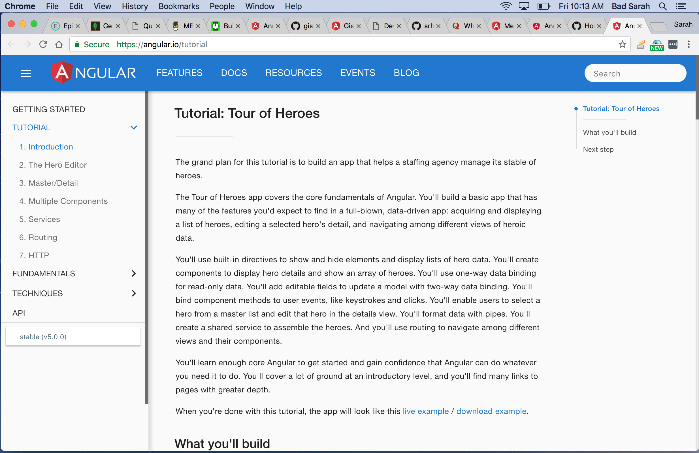
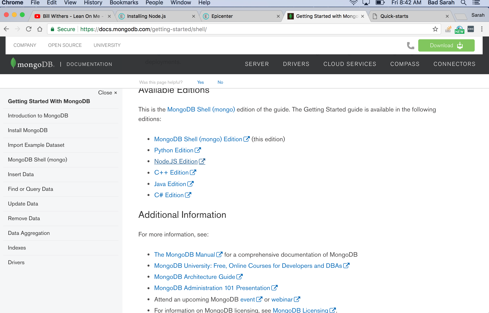

# _Code Review Project Log_

#### MEAN-Todo-App Project implementing MongoDB, Express, Angular2, & NodeJS.
#### Author: Sarah Lindmar

## Career Development Goals:

* Learn MEAN stack project development to prepare for internship at Bent.
* Get headshot taken for portfolio.
* Udpate github repositories.
* Create a new portfolio using Angular2.
* Sign up for Linkedin and Twitter.
* Practice whiteboard interview [questions](https://www.glassdoor.com/Interview/oilers-interview-questions-SRCH_KO0,6.htm).

## MEAN stack resources found today:     

* [MEAN app with Angular2 and Angular-CLI](https://scotch.io/tutorials/mean-app-with-angular-2-and-the-angular-cli).
  
* [Hackernoon build a real-time MEAN app with Angular-CLI and socket-io](https://hackernoon.com/build-real-time-app-with-mean2-angular-cli-and-socket-io-cedf1dc02fec).
  
* [Angular tutorial: Tour of Heroes](https://angular.io/tutorial)
  
* [Treehouse guide to installing MongoDB on Mac](https://treehouse.github.io/installation-guides/mac/mongo-mac.html)
  
* [Install MongoDB community edition MacOS](https://docs.mongodb.com/manual/tutorial/install-mongodb-on-os-x/)

## Support and Contact Details

_If you have any comments or suggestions please make a contribution to my repository_

### License

*This project is licensed under the MIT license*

Copyright (c) 2017 **_Sarah Lindmar_**
